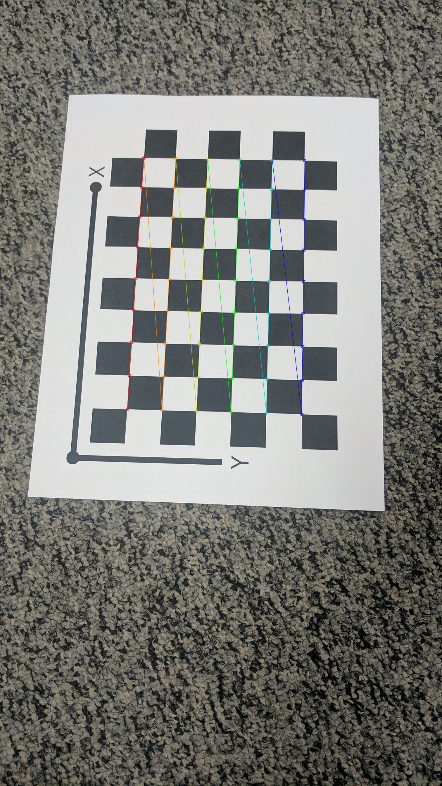
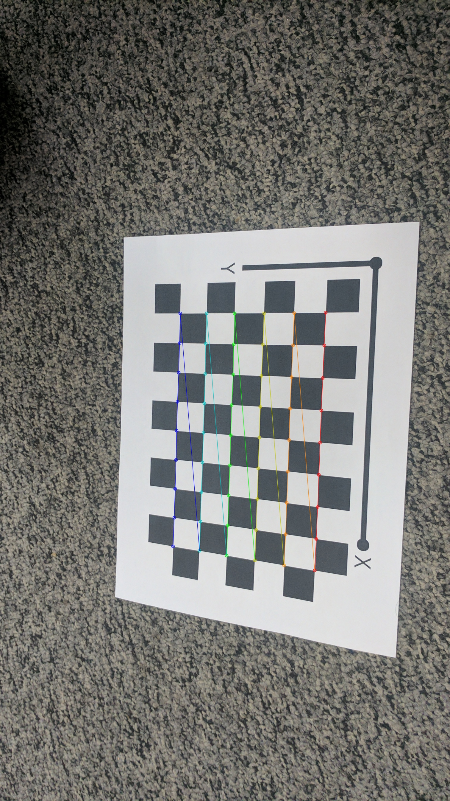
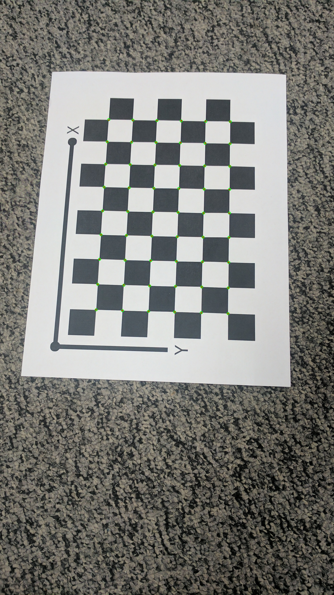
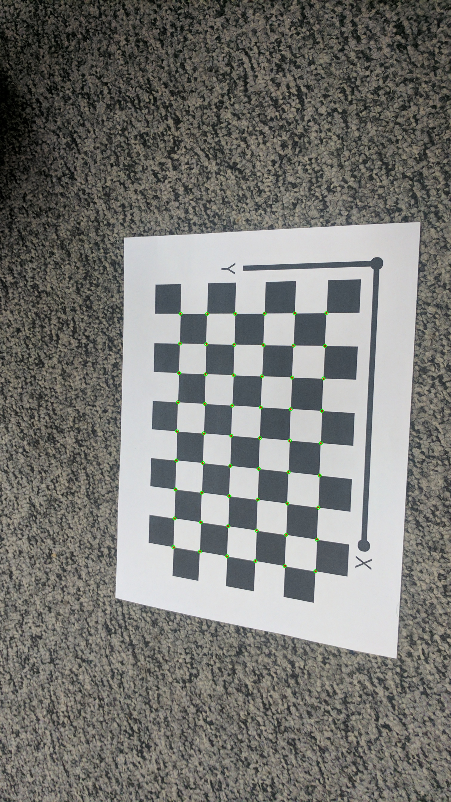
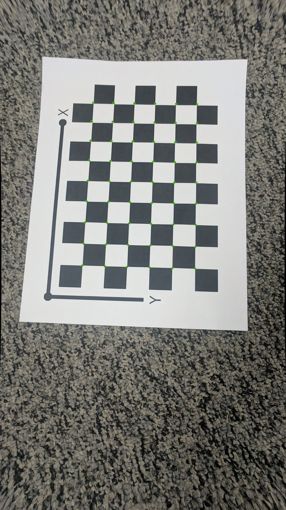
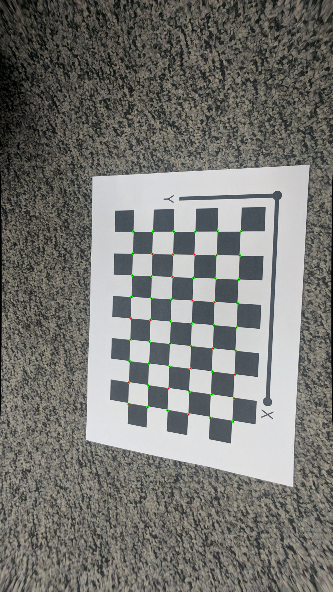

# Camera Calibration using Zhang's Method ~ Prasham Soni

This repository contains a Python implementation of Zhang's camera calibration technique using a planar checkerboard pattern. The code estimates both intrinsic and extrinsic parameters by detecting checkerboard corners in calibration images, computing homographies, and refining the estimates via non-linear optimization. It also demonstrates image undistortion and visualizes the reprojected corners.

## Overview

The calibration pipeline includes the following steps:

1. **Image Acquisition and Corner Detection:**  
   - Read a set of JPEG images from a specified folder.
   - Detect checkerboard corners using OpenCV's `findChessboardCorners` and refine them with sub-pixel accuracy.
2. **Initial Parameter Estimation:**  
   - Compute homographies using the Direct Linear Transform (DLT).
   - Build a constraint matrix and extract the initial intrinsic parameters \(K\) from the homographies.
   - Estimate the extrinsic parameters (rotation \(R\) and translation \(t\)) for each image.
3. **Parameter Refinement via Non-Linear Optimization:**  
   - Formulate and solve a joint optimization problem that minimizes the reprojection error between the detected corners and the reprojected points, while also estimating lens distortion coefficients (\(k_1\) and \(k_2\)).
4. **Image Undistortion and Visualization:**  
   - Use the refined calibration parameters to undistort the images.
   - Visualize the calibration quality by overlaying the detected and reprojected corners on the images.

## Requirements

- Python 3.x
- OpenCV (`cv2`)
- NumPy
- SciPy

You can install the required packages using pip:

```bash
pip install opencv-python numpy scipy

## Outputs
Original image:

<p align="center">
  <table>
    <tr>
      <td>  </td>
      <td>  </td>
      
    </tr>
    <tr>
      <td align="center">Checker_board 1</td>
      <td align="center">Checker_board 2</td>
      
      
    </tr>
  </table>
</p>


Reprojection Visualization
<p align="center">
  <table>
    <tr>
      <td>  </td>
      <td>  </td>
      
    </tr>
    <tr>
      <td align="center">Reprojection 1</td>
      <td align="center">Reprojection 2</td>
      
      
    </tr>
  </table>
</p>

Reprojection Visualization
<p align="center">
  <table>
    <tr>
      <td>  </td>
      <td>  </td>
      
    </tr>
    <tr>
      <td align="center">Undistorted Image 1</td>
      <td align="center">Undistorted Image 2</td>
      
      
      
    </tr>
  </table>
</p>